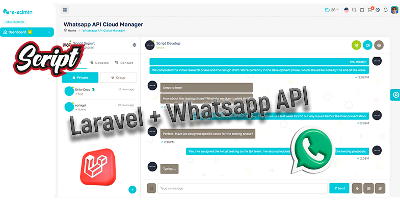

---
# Tutorial: Chat de WhatsApp Básico con Laravel 12, Reverb y Blade

Este repositorio acompaña a un video tutorial sobre cómo crear un chat básico al estilo WhatsApp usando **Laravel 12**, **Reverb**, **Blade** y **JavaScript** (sin Livewire). Además, se explica el uso del paquete [`@djdang3r/whatsapp-api-manager`](https://www.npmjs.com/package/@djdang3r/whatsapp-api-manager).

## Objetivo

- Aprender a usar Laravel 12 con Reverb para comunicación en tiempo real.
- Construir un frontend sencillo con Blade y JavaScript puro.
- Integrar el paquete `@djdang3r/whatsapp-api-manager` para gestionar la API de WhatsApp.
- Crear un chat funcional básico, ideal para principiantes.

## Tecnologías utilizadas

- [Laravel 12](https://laravel.com/docs/12.x)
- [Reverb (Laravel Realtime)](https://laravel.com/docs/12.x/reverb)
- Blade (sin Livewire)
- JavaScript
- [@djdang3r/whatsapp-api-manager](https://www.npmjs.com/package/@djdang3r/whatsapp-api-manager)

## Estructura del tutorial

1. Instalación y configuración de Laravel 12 y Reverb.
2. Creación de vistas con Blade.
3. Implementación de la lógica de chat en JavaScript.
4. Integración del paquete `@djdang3r/whatsapp-api-manager`.
5. Pruebas y demostración del chat en tiempo real.

## Requisitos

- PHP 8.2+
- Node.js y npm
- Composer

## Instalación rápida

```bash
git clone https://github.com/tu-usuario/laravel-whatsapp-reverb-tutorial.git
cd laravel-whatsapp-reverb-tutorial
composer install
npm install
cp .env.example .env
php artisan key:generate
# Configura tu base de datos en .env
php artisan migrate
npm run dev
php artisan serve
```

## Créditos

- Tutorial y código por djdang3r
- Paquete [@djdang3r/whatsapp-api-manager](https://www.npmjs.com/package/@djdang3r/whatsapp-api-manager)

---

¡Sigue el video para ver la implementación paso a paso!


## Pasos del Tutorial

- Instalacion laravel 12.
- Instalacion plantilla
  - Layout
  - assets
- Instalara whatsapp-api-manager
  - Instalacion completa
- Registrar Cuenta de whatsapp api cloud
  - Vista
  - Controlador
  - Ruta
- Livechat
  - Boton livechat en tabla dashboard
  - Vista principal
  - Ruta
  - Controlador
  - Listar Contactos
  - Enviar mensaje
  - Instalacion Laravel Reverb
  - Configuracion Laravel Reverb, echo.js y canales publicos
    - .env     WHATSAPP_BROADCAST_CHANNEL_TYPE=public
    - Configuracion echo.js y canal mensajes
    - Render mensaje nuevo
